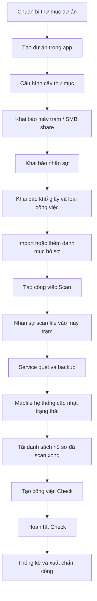

# Hướng Dẫn Bắt Đầu Với 1 Dự Án Mới

Tài liệu này hướng dẫn setup một dự án số hóa mới từ lúc chuẩn bị thư mục, khai báo cấu hình, tạo công việc Scan/Check đến bước xuất dữ liệu chấm công theo ngày.

## 1. Sơ đồ luồng vận hành



## 2. Chuẩn bị trước khi tạo dự án

Tạo sẵn các thư mục trên máy chủ. Ví dụ cho dự án `DEMO`:

```text
D:\ScanProjects\DEMO\
├─ backup\
├─ staging\
├─ conflicts\
└─ reports\
```

Ý nghĩa:

- `backup`: nơi lưu file PDF đã backup thành công.
- `staging`: nơi app dùng tạm khi xử lý file.
- `conflicts`: nơi lưu file trùng/xung đột cần xử lý thủ công.
- `reports`: nơi xuất báo cáo Excel.

Chuẩn bị nguồn scan từ máy trạm hoặc SMB share. Ví dụ:

```text
\\192.168.1.71\csdl_sohoa_demo
```

Tài khoản Windows chạy app/service cần có quyền đọc nguồn scan và quyền ghi vào thư mục backup/staging/conflicts/reports.

## 3. Đăng nhập quản trị

1. Mở `ScanBackupManager.exe` hoặc chạy từ source.
2. Chọn khu vực quản trị viên.
3. Đăng nhập bằng mật khẩu admin.
4. Nếu là DB mới, mật khẩu mặc định là:

```text
Admin@123
```

Nên đổi mật khẩu trong phần cấu hình chung trước khi vận hành thật.

## 4. Tạo dự án mới

Vào `Danh sách dự án` rồi bấm `Tạo dự án mới`.

Điền:

- `Mã dự án`: ví dụ `DEMO`. Mã này được dùng để tạo file SQLite phụ `project_databases/DEMO.sqlite3`.
- `Tên hiển thị`: ví dụ `Dự án Demo`.
- `Thư mục backup`: `D:\ScanProjects\DEMO\backup`
- `Thư mục staging`: `D:\ScanProjects\DEMO\staging`
- `Kho xung đột`: `D:\ScanProjects\DEMO\conflicts`
- `Thư mục báo cáo`: `D:\ScanProjects\DEMO\reports`

Sau khi tạo, mở dự án để vào bảng điều khiển.

## 5. Cấu hình cây thư mục hồ sơ

Vào tab `Cấu hình` > `Dự án & cây thư mục`.

Một cấu hình phổ biến:

| Thứ tự | Tên cấp | Kiểu kiểm tra | Ví dụ |
|---:|---|---|---|
| 1 | Năm | YEAR4 | `2025` |
| 2 | Loại hồ sơ | ENUM | `BAN_VE`, `HO_SO`, `PHAP_LY` |
| 3 | Mã hồ sơ | TEXT hoặc INTEGER | `001` |

Khi cấu hình như trên, một hồ sơ hợp lệ có dạng:

```text
2025/BAN_VE/001
```

Nếu cần lọc chọn hồ sơ khi tạo việc, bật yêu cầu chọn theo danh mục cho các cấp tương ứng.

## 6. Khai báo máy trạm

Vào tab `Cấu hình` > `Máy trạm`.

Thêm từng máy trạm/share:

- `Mã máy`: ví dụ `SCAN01`.
- `Nhân sự phụ trách`: ví dụ `Nguyễn Văn A`.
- `Đường dẫn share`: ví dụ `\\192.168.1.71\csdl_sohoa_demo`.
- Bật trạng thái hoạt động.

Có thể nhập/xuất Excel bằng các nút `Nhập Excel` và `Xuất Excel`.

## 7. Khai báo nhân sự

Vào tab `Cấu hình` > `Nhân sự`.

Thêm nhân sự:

| Mã nhân sự | Họ tên | Vai trò |
|---|---|---|
| NV01 | Nguyễn Văn A | Scan |
| NV02 | Trần Thị B | Check |

Có thể nhập/xuất Excel bằng mẫu `mau_nhap_nhan_su.xlsx`.

## 8. Khai báo khổ giấy và công việc

Vào tab `Cấu hình`:

- `Khổ giấy`: khai báo A4, A3 hoặc các khổ cần quản lý.
- `Công việc`: khai báo loại Scan/Check. Ví dụ:
  - `SCAN_A4`: Scan A4
  - `SCAN_A3`: Scan A3
  - `CHECK_SCAN`: Check Scan

Với hồ sơ có A3 cần scan tiếp, bật lựa chọn phù hợp khi tạo việc Scan.

## 9. Import hoặc thêm danh mục hồ sơ

Vào tab `Mapfile hệ thống` hoặc `Danh mục hồ sơ`.

Có hai cách:

1. Import mapfile Excel.
2. Thêm thủ công dòng hồ sơ theo cây thư mục đã cấu hình.

Ví dụ dòng hồ sơ:

```text
Năm: 2025
Loại hồ sơ: BAN_VE
Mã hồ sơ: 001
```

Mục tiêu là để hệ thống biết hồ sơ nào cần scan/check và đối chiếu được với file backup thực tế.

## 10. Tạo công việc Scan

Vào tab `Mapfile hệ thống` > tạo công việc.

Chọn:

- `Công việc`: một loại Scan.
- `Nhân sự đảm nhiệm`: nhân sự scan.
- `Máy trạm`: nguồn scan tương ứng.
- Các dòng hồ sơ cần scan.

Bấm `Tạo công việc`.

Sau khi nhân sự scan file PDF vào đúng thư mục nguồn, Windows Service hoặc pipeline backup sẽ quét và sao lưu file vào `backup_root`.

## 11. Kiểm tra trạng thái scan/backup

Vào `Mapfile hệ thống`.

Theo dõi các trạng thái chính:

- Đã tìm thấy file scan.
- Đã backup.
- Chờ check.
- Lỗi cấu trúc.
- Xung đột/trùng file.

Service cũng tự tạo job kiểm tra hash hằng ngày để xác nhận file backup.

## 12. Tạo công việc Check

Khi chọn công việc là `Check Scan`, không chọn từ toàn bộ danh mục.

Luồng đúng:

1. Chọn `Công việc`: `Check Scan`.
2. Chọn nhân sự check.
3. Bấm nút tải/lọc danh sách hồ sơ đã scan xong.
4. Lọc theo từng cấp nếu cần: năm, loại hồ sơ, mã hồ sơ.
5. Tick các hồ sơ đang chờ check.
6. Bấm `Tạo công việc`.

Danh sách Check chỉ hiển thị hồ sơ đã hoàn thành scan/backup, đã sao lưu và chưa check.

## 13. Hoàn tất Check

Nhân sự check xử lý công việc được giao.

Khi check xong, cập nhật/chốt trạng thái để hồ sơ chuyển khỏi trạng thái chờ check. Nếu phát hiện lỗi cần scan lại, chuyển về trạng thái yêu cầu scan lại theo quy trình dự án.

## 14. Xem thống kê trong ngày

Vào tab `Thống kê`.

Chọn khoảng ngày, ví dụ:

```text
Từ ngày: 10/07/2026
Đến ngày: 10/07/2026
```

Bấm `Xem thống kê`.

Màn hình hiển thị:

- Tổng sản lượng.
- Số công việc đã chốt.
- Số loại công việc.
- Nhân sự tham gia.
- Nhân sự đó làm việc gì trong ngày.
- Nếu có nhiều công việc, hệ thống hiển thị thứ tự, công việc, sản lượng và giờ bắt đầu.

## 15. Xuất dữ liệu chấm công

Trong tab `Thống kê`, sau khi chọn khoảng ngày, bấm `Xuất chấm công`.

File được tạo trong thư mục báo cáo của dự án:

```text
attendance_report_<date_from>_<date_to>_YYYYMMDD_HHMMSS.xlsx
```

File có 2 sheet:

| Sheet | Nội dung |
|---|---|
| `Cham cong` | Chi tiết ngày, mã nhân sự, họ tên, thứ tự công việc, công việc, loại Scan/Check, sản lượng, số đã chốt, giờ bắt đầu, giờ cập nhật |
| `Tong hop` | Tổng hợp theo ngày và nhân sự: số công việc, tổng sản lượng, số đã chốt, giờ bắt đầu đầu tiên |

## 16. Checklist nghiệm thu dự án mới

- Đã tạo đủ thư mục `backup`, `staging`, `conflicts`, `reports`.
- Đã tạo dự án và thấy file SQLite phụ theo mã dự án.
- Đã cấu hình cây thư mục đúng thực tế.
- Đã khai báo máy trạm/share SMB.
- Đã khai báo nhân sự.
- Đã khai báo khổ giấy và công việc Scan/Check.
- Đã import hoặc thêm danh mục hồ sơ.
- Tạo thử một việc Scan cho hồ sơ mẫu.
- File scan được backup vào đúng thư mục đích.
- Hồ sơ scan xong xuất hiện trong danh sách tạo việc Check.
- Tạo được việc Check từ danh sách hồ sơ đã scan xong.
- Tab Thống kê hiển thị nhân sự, công việc, sản lượng, giờ bắt đầu.
- Xuất được file chấm công Excel.

## 17. Xử lý nhanh lỗi thường gặp

| Hiện tượng | Cách kiểm tra |
|---|---|
| Không thấy hồ sơ để tạo Check | Kiểm tra hồ sơ đã backup thành công, trạng thái đang chờ check và chưa có việc Check đang mở |
| Không backup được file | Kiểm tra quyền đọc SMB share và quyền ghi vào `backup_root` |
| Báo sai cấu trúc | Kiểm tra cây thư mục nguồn có đúng thứ tự cấp đã cấu hình không |
| Không xuất được Excel | Kiểm tra quyền ghi thư mục `reports` |
| Xóa dự án không mất file backup | Đây là hành vi chủ đích; app không tự xóa thư mục backup vật lý |
